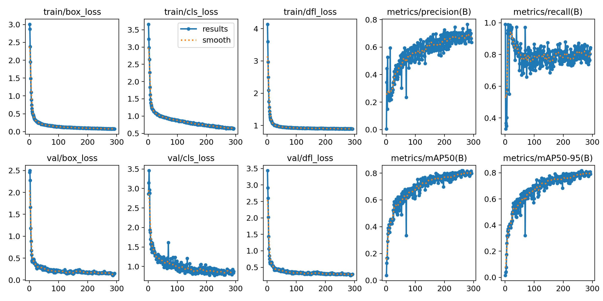
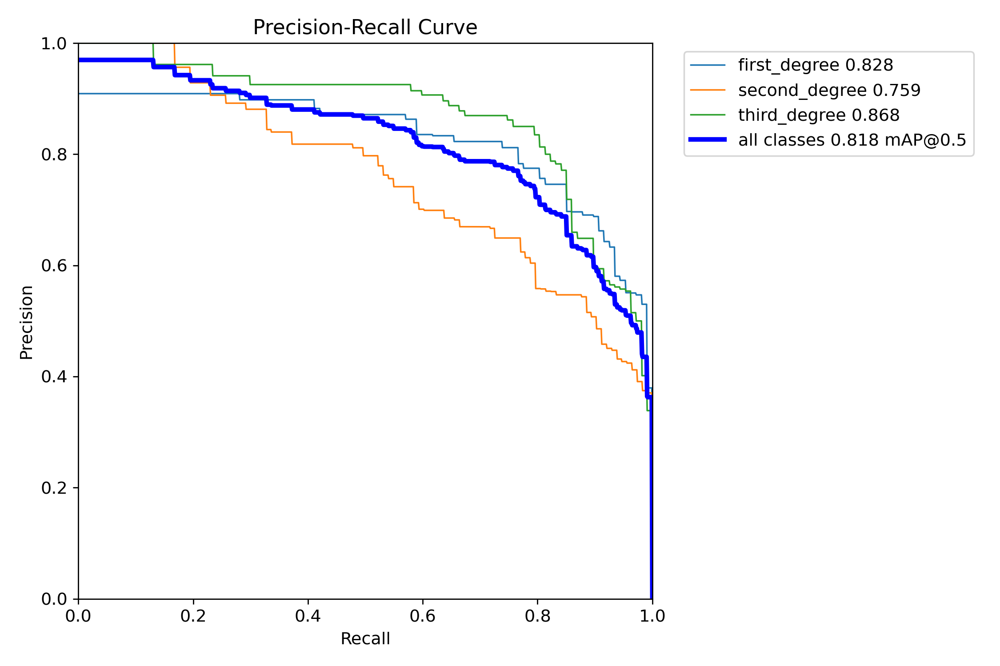
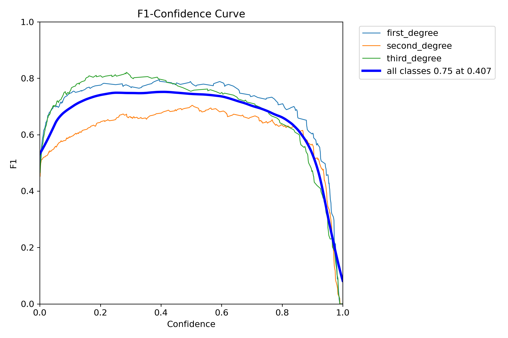
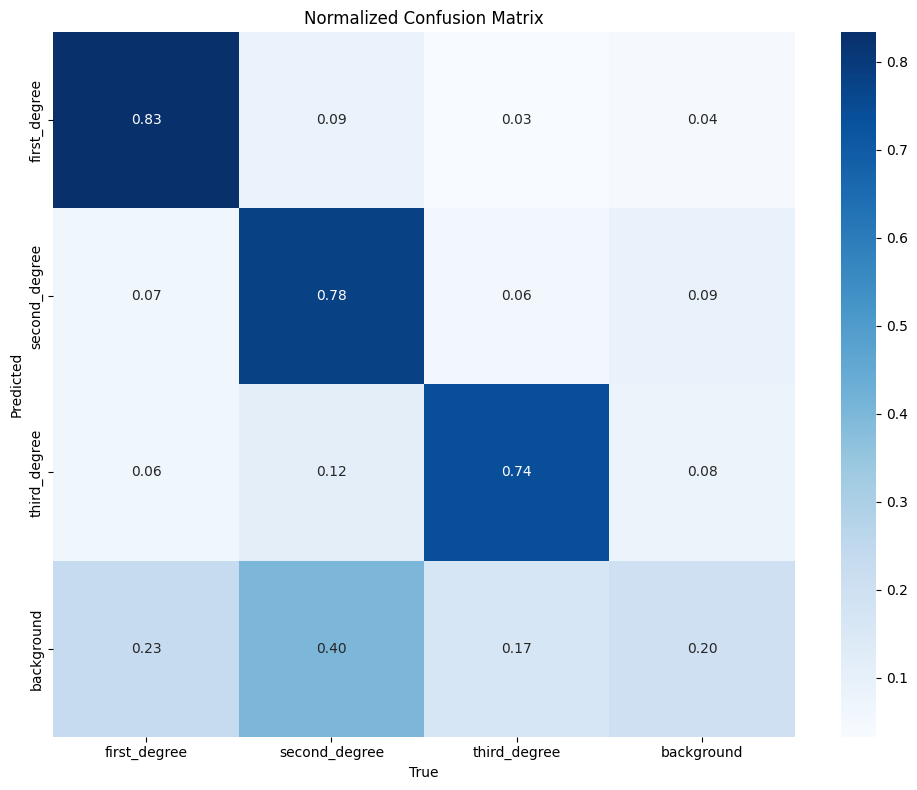
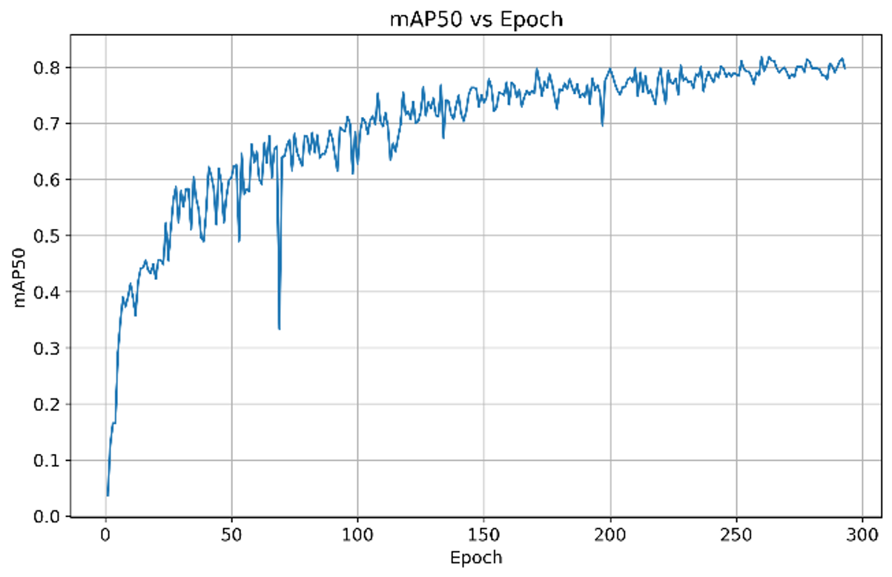
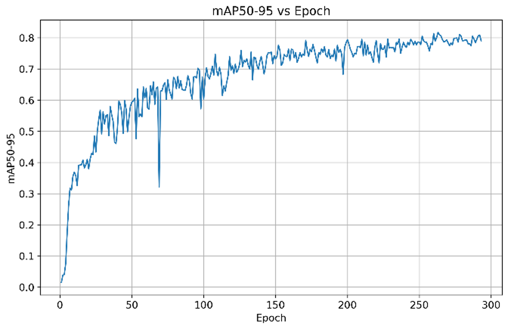

# A Lightweight Hybrid YOLO-Based Framework for Real-Time Skin Burn Detection and Classification

A lightweight object-detection model that localizes skin burns and classifies their
severity into **first-, second-, and third-degree** in real time.

The proposed model keeps the **YOLOv8n** detection framework but replaces its backbone
with the lighter, **C3k2-based YOLOv11n backbone** — achieving competitive accuracy at a
fraction of the computational cost, making it suitable for resource-limited clinical settings.

---

## Highlights

| Metric | Proposed Model |
|---|---|
| Accuracy | **81.7%** |
| Parameters | **2.25 M** |
| GFLOPs | **2.25** |
| Model size | **4.60 MB** |
| Speed | **11.69 FPS** |
| mAP@0.5 | 81.8% |
| mAP@0.5:0.95 | 81.7% |

### Per-class results

| Class | Precision | Recall | mAP@0.5 | mAP@0.5:0.95 |
|---|---|---|---|---|
| First-degree | 74.3% | 83.8% | 82.8% | 82.6% |
| Second-degree | 59.4% | 79.6% | 75.9% | 75.7% |
| Third-degree | 86.7% | 73.2% | 86.8% | 86.7% |
| **Overall** | **73.5%** | **78.9%** | **81.8%** | **81.7%** |

---

## Repository structure

```
├── Code/
│   └── train.py                              # training script (Experiment 2 — proposed model)
├── Dataset/
│   ├── Datasetlink.txt                       # link to the full dataset
│   └── Skin_Burn_Sample.jpg                  # sample image
├── Proposed Model/
│   └── yolov8n-yolov11n-backbone.yaml        # hybrid architecture (YOLOv11n C3k2 backbone + YOLOv8n head)
├── Visuals/                                  # training curves, PR/F1 curves, confusion matrix, results
├── Weights/
│   └── best.pt                               # trained model weights
├── requirements.txt
└── README.md
```

---

## Setup

```bash
git clone https://github.com/SyedMujtabaAshar/A-Lightweight-Hybrid-YOLO-Based-Framework-for-Real-Time-Skin-burn-Detection-and-Classification.git
cd A-Lightweight-Hybrid-YOLO-Based-Framework-for-Real-Time-Skin-burn-Detection-and-Classification
pip install -r requirements.txt
```

## Dataset

The full dataset (RGB skin-burn images with bounding-box annotations for three severity
classes) is available at the link in [`Dataset/Datasetlink.txt`](./Dataset/Datasetlink.txt).
A sample image is provided in the `Dataset/` folder.

The annotations were drawn in CVAT and validated by a dermatologist. Augmentation used
rotation and brightness adjustment.

## Training

```bash
python "Code/train.py"
```

Training recipe (matches the thesis):
`640×640 · Adam · lr 0.01 · batch 16 · ≤300 epochs (patience 30) · 70/20/10 split`

## Evaluation & Inference

```python
from ultralytics import YOLO

model = YOLO("Weights/best.pt")

# per-class Precision / Recall / mAP
model.val()

# parameters and GFLOPs
model.info()

# run inference on new images
model.predict(source="path/to/images", conf=0.25, save=True)
```

---

## Model architecture

The proposed hybrid keeps YOLOv8n's anchor-free detection head and PAN-FPN neck, and
replaces the backbone with the full **YOLOv11n backbone built on C3k2 blocks**
(a lighter, more efficient successor to YOLOv8's C2f block).

```
Input → [YOLOv11n C3k2 backbone] → [PAN-FPN neck] → [YOLOv8n head] → 3 severity classes
```

Architecture definition: [`Proposed Model/yolov8n-yolov11n-backbone.yaml`](./Proposed%20Model/yolov8n-yolov11n-backbone.yaml)

---

## Results

**Overall training results**



**Precision–Recall & F1 curves**




**Confusion matrix (normalized)**



**mAP over training**




---

## Notes

- Confidence scores reported per class are the mean of the model's per-detection
  confidence (`box.conf`), which is distinct from precision, recall and mAP.
- `best.pt` is the checkpoint with the best validation mAP.

## Citation

If you use this work, please cite the associated MS thesis (FAST-NUCES).

## License

Released under the MIT License. YOLO components are subject to the
Ultralytics AGPL-3.0 license.
